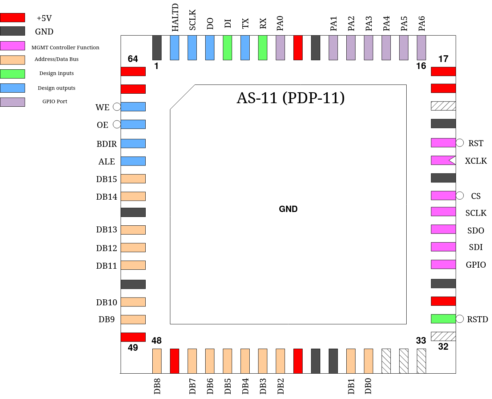

.. _as11:

AS-11
=====

This project is a 16-bit processor intended to be bytecode compatible with the PDP11/40. It implements the complete base integer instruction set, including the EIS instructions. The FPU is not implemented.

------
Pinout
------

.. list-table:: Pin description
    :name: as-11-pin-description
    :header-rows: 1
    
    * - Pin #
      - Name
      - Type
      - Summary
    * - ``mprj_io[0]``
      - RSTD
      - I
      - Active low design reset
    * - ``mprj_io[20:5]``
      - DB[15:0]
      - IO
      - Address/Data Bus
    * - ``mprj_io[21]``
      - ALE
      - O
      - Address Latch Enable
    * - ``mprj_io[22]``
      - BDIR
      - O
      - Indicates current direction of DB[15:0] pins, low = outputs, high = inputs
    * - ``mprj_io[23]``
      - OE
      - O
      - Active low memory Output Enable
    * - ``mprj_io[24]``
      - WE
      - O
      - Active low memory Write Enable
    * - ``mprj_io[25]``
      - HALTD
      - O
      - Output indicating if a HALT or WAIT instruction has been executed and the CPU halted
    * - ``mprj_io[26]``
      - SCLK
      - O
      - SPI master port Serial Clock
    * - ``mprj_io[27]``
      - DO
      - O
      - SPI master port Serial Data Out
    * - ``mprj_io[28]``
      - DI
      - I
      - SPI master port Serial Data In
    * - ``mprj_io[29]``
      - TX
      - O
      - UART serial transmit data
    * - ``mprj_io[30]``
      - RX
      - I
      - UART serial receive data
    * - ``mprj_io[37:31]``
      - PA[6:0]
      - IO
      - General-purpose IO port

----------
Memory Bus
----------

The AS-11 multiplexes address and data information on the same 16 pins and addresses memory as 32,768 words of 16 bits each. Though the CPU architecture addresses memory as 8-bit bytes, the bus implementation is simplified into only 16-bit memory accesses.

The chip indicates that it is presenting address information via a high level on ``ALE``, which can be used to trigger transparent latches (i.e. 74HC573) to pass through, then latch the address. Only pins ``DB[15:1]`` contain valid address information, with the value on ``DB0`` being meaningless. This means that ``address[14:0] == DB[15:1]``. If the CPU executes an instruction that neccesitates an 8-bit write, the bus interface will execute a read-modify-write cycle to change only the required byte.

Example timing diagram of an instruction fetch and execution resulting in a memory write:

.. wavedrom::

    {signal: [
    {name: 'CLK', wave: 'n.......', period: 2},
    {name: 'ALE', wave: '010..10....10...'},
    {name: 'OE', wave: '1..0.1.0.1......'},
    {name: 'WE', wave: '1............01.'},
    {name: 'DB', wave: 'x5.7.5.7.x.5.8.x', data: 'addr[14:0] data[15:0] addr[14:0] data[15:0] addr[14:0] data[15:0]'},
    {name: 'BDIR', wave: '10.1.0.1...0...1'}
    ],config: { hscale: 1 }}

Note: this example uses ``WEB`` in ``reg_mprj_settings`` set to ``2``.

-----------------
Programming Model
-----------------

The AS-11 contains 8, 16-bit scratch registers labeled ``R0`` through ``R7``. However, traditionally, ``R6`` is used as the stack pointer and thus also labeled as ``SP`` and ``R7`` doubles as the Program Counter, labeled ``PC``, and always points to the word following the current instruction.

There is also a 8-bit wide Processor Status Word (``PSW``) register containing the following information:

.. wavedrom::

	{ "reg": [
	  {"name": "C", "bits": 1},{"name": "V", "bits": 1},{"name": "Z", "bits": 1},{"name": "N", "bits": 1},{"name": "T", "bits": 1},{"name": "prio[2:0]", "bits": 3}],
	 "config": {"hspace": 700}
	}

The first four bits all update depending on the result of the last logical or arithmetic operation as follows:

``C`` Carry: Set if the result of an addition or subtraction resulted in a carry out of the most-significant bit

``V`` Overflow: Set if the result of the operation could not be contained within a signed 16-bit integer

``Z`` Zero: Set if the result of the operation equals to zero

``N`` Negative: Set if the result of the operation is negative (most significant bit is set)

The ``T`` bit is the Trace enable, a software debugging tool. When set, a Trace Trap interrupt is triggered after the completion of every instruction, which can be used to single-step programs inside a software debugger.

The ``prio`` field has to do with the interrupt model of the processor and is described in detail in the Interrupts section below.

All scratch registers and the ``PSW`` register clear to zero on reset.

Lastly, there is ``IVB``, which determines the starting address of the table of interrupt vectors.

.. wavedrom::

	{ "reg": [
	  {"type": "1", "bits": 5},{"name": "IVB[15:5]", "bits": 11}],
	 "config": {"hspace": 700}
	}

Note that the least-significant 5 bits are hard-wired to zero and cannot be written.

----------------
Addressing modes
----------------

Unless otherwise specified, every instruction follows the same method of using a 3-bit wide field to encode the particular addressing mode used for an operand, which will be labeled ``MODE`` from here on out, followed by a 3-bit register index to be used in that mode, labeled ``Rn``.

The possible modes are:

Register
--------

``MODE`` value: ``0``

Assembler syntax: ``Rn``

Register ``Rn`` contains the operand.

Register Deferred
-----------------

``MODE`` value: ``1``

Assembler syntax: ``(Rn)``

Register ``Rn`` contains the address of the operand (effectively a pointer).

Autoincrement
-------------

``MODE`` value: ``2``

Assembler syntax: ``(Rn)+``

Register ``Rn`` contains the address of the operand. After the operation, ``Rn`` is incremented. The increment is by one if a 8-bit byte was addressed and by two if a 16-bit word was addressed.

Autoincrement Deferred
----------------------

``MODE`` value: ``3``

Assembler syntax: ``@(Rn)+``

Register ``Rn`` contains the address of the address of the operand (a pointer to a pointer in memory). After the operation, ``Rn`` is incremented by two.

Autodecrement
-------------

``MODE`` value: ``4``

Assembler syntax: ``-(Rn)``

First, ``Rn`` is decremented. The decrement is by one if a 8-bit byte is addressed and by two if a 16-bit word is addressed. Then, register ``Rn`` contains the address of the operand.

Autodecrement Deferred
----------------------

``MODE`` value: ``5``

Assembler syntax: ``@-(Rn)``

First, ``Rn`` is decremented by two. Then, register ``Rn`` contains the address of the address of the operand (a pointer to a pointer in memory).

Indexed
-------

``MODE`` value: ``6``

Assembler syntax: ``X(Rn)``

The value of register ``Rn`` plus X is the address of the operand. X is a signed 16-bit word appended after the opcode. The length of the instruction increases by one word for each time this mode is used.

Indexed Deferred
----------------

``MODE`` value: ``7``

Assembler syntax: ``@X(Rn)``

The value of register ``Rn`` plus X is the address of the address of the operand. X is a signed 16-bit word appended after the opcode. The length of the instruction increases by one word for each time this mode is used.

Stack Pointer
-------------

Register ``R6`` is used as the Stack Pointer mostly just by convention. Any register except ``R7`` can be used as a stack pointer through the Autoincrement and Autodecrement modes.

``PC`` as ``Rn``
----------------

Since register ``R7`` is the Program Counter, several additional addressing modes can be realized by specifying it as ``Rn``. The most common are:

.. list-table:: Additional addressing modes
    :name: as-11-using-r7-as-rn
    :header-rows: 1
    
    * - ``MODE``
      - Name
      - Assembler Syntax
      - Function
    * - ``2``
      - Immediate
      - ``#n``
      - Operand follows instruction
    * - ``3``
      - Absolute
      - ``@#A``
      - Absolute Address follows instruction
    * - ``6``
      - Relative
      - ``A``
      - Relative Address (index value) follows instruction
    * - ``7``
      - Relative Deferred
      - ``@A``
      - As above, but Relative Address contains address of operand

Byte- and Word-addressing
-------------------------

Instructions may address either 8-bit bytes or 16-bit words. In the former case, any address in memory is valid. In the latter case, the address must be even (word-aligned).

There are only a few non-branch instructions that only support one of these two and unless otherwise specified, the most-significant bit of the instruction (labeled ``B`` in documentation below) is set to indicate byte-addressing. If it is clear, word-addressing is specified.

In the case of ``MODE`` being ``0``, byte-addressing will only source the least-significant 8 bits of the register and only modify those bits. The most-significant 8 bits will remain unaltered.

-------------------
Instruction Formats
-------------------

Single Operand
--------------

.. wavedrom::

	{ "reg": [
	  {"name": "Rn", "bits": 3},{"name": "MODE", "bits": 3},{"name": "OP CODE", "bits": 10}],
	 "config": {"hspace": 700}
	}

Instructions operating on a single operand in-place use this formating.

Double Operand
--------------

.. wavedrom::

	{ "reg": [
	  {"name": "Rn", "bits": 3},{"name": "dest MODE", "bits": 3},{"name": "Rn", "bits": 3},{"name": "src MODE", "bits": 3},{"name": "OP CODE", "bits": 4}],
	 "config": {"hspace": 700}
	}

Instructions combining two operands. The exact way the operands are used depends on the exact instruction.

Register- Source or Destination
-------------------------------

.. wavedrom::

	{ "reg": [
	  {"name": "Rn", "bits": 3},{"name": "src/dest MODE", "bits": 3},{"name": "REG", "bits": 3},{"name": "OP CODE", "bits": 7}],
	 "config": {"hspace": 700}
	}

Instructions that always use a register as one operand, the other being defined by ``MODE`` and ``Rn``. Which of these is the source and which is the destination depends on the exact instruction.

Branch
------

.. wavedrom::

	{ "reg": [
	  {"name": "OFFSET", "bits": 8},{"name": "OP CODE", "bits": 8}],
	 "config": {"hspace": 700}
	}

Instructions that affect a relative branch. The offset is a signed 8-bit value encoded in the instruction, which is additionally multiplied by two before being added to the Program Counter, so the offset is always even.

Implied
-------

.. wavedrom::

	{ "reg": [
	  {"name": "OP CODE", "bits": 16}],
	 "config": {"hspace": 700}
	}

All aspects of the instruction operation are fixed and all addressing modes (if any) implied by the operation.

---------------
Instruction Set
---------------

CLR / CLRB - Clear
------------------

.. wavedrom::

	{ "reg": [
	  {"name": "Rn", "bits": 3},{"name": "MODE", "bits": 3},{"name": 0b000101000, "bits": 9},{"name": "B", "bits": 1}],
	 "config": {"hspace": 700}
	}

The contents of the specified destination are replaced with zeroes.

**Condition Codes:**

``N`` is cleared

``Z`` is set

``V`` is cleared

``C`` is cleared

COM / COMB - Complement
-----------------------

.. wavedrom::

	{ "reg": [
	  {"name": "Rn", "bits": 3},{"name": "MODE", "bits": 3},{"name": 0b000101001, "bits": 9},{"name": "B", "bits": 1}],
	 "config": {"hspace": 700}
	}

Replaces the contents of the destination with their logical complement.

**Condition Codes:**

``N`` is affected as defined

``Z`` is affected as defined

``V`` is cleared

``C`` is set

INC / INCB - Increment
----------------------

.. wavedrom::

	{ "reg": [
	  {"name": "Rn", "bits": 3},{"name": "MODE", "bits": 3},{"name": 0b000101010, "bits": 9},{"name": "B", "bits": 1}],
	 "config": {"hspace": 700}
	}

Adds one to the contents of the destination.

**Condition Codes:**

``N`` is affected as defined

``Z`` is affected as defined

``V`` is set if destination held 0x7F (byte) or 0x7FFF (word), cleared otherwise

``C`` is unchanged

DEC / DECB - Decrement
----------------------

.. wavedrom::

	{ "reg": [
	  {"name": "Rn", "bits": 3},{"name": "MODE", "bits": 3},{"name": 0b000101011, "bits": 9},{"name": "B", "bits": 1}],
	 "config": {"hspace": 700}
	}

Subtracts one from the contents of the destination.

**Condition Codes:**

``N`` is affected as defined

``Z`` is affected as defined

``V`` is set if destination held 0x80 (byte) or 0x8000 (word), cleared otherwise

``C`` is unchanged

NEG / NEGB - Negate
-------------------

.. wavedrom::

	{ "reg": [
	  {"name": "Rn", "bits": 3},{"name": "MODE", "bits": 3},{"name": 0b000101100, "bits": 9},{"name": "B", "bits": 1}],
	 "config": {"hspace": 700}
	}

Replaces the contents of the destination by their two’s complement.

**Condition Codes:**

``N`` is affected as defined

``Z`` is affected as defined

``V`` is set if result equals 0x80 (byte) or 0x8000 (word), cleared otherwise

``C`` is cleared if the result is zero, set otherwise

TST / TSTB - Test
-----------------

.. wavedrom::

	{ "reg": [
	  {"name": "Rn", "bits": 3},{"name": "MODE", "bits": 3},{"name": 0b000101111, "bits": 9},{"name": "B", "bits": 1}],
	 "config": {"hspace": 700}
	}

Sets the condition codes ``N`` and ``Z`` according to the contents of the destination, but does not modify contents.

**Condition Codes:**

``N`` is set if the destination contents are negative, cleared otherwise

``Z`` is set if the destination contents are zeroes, cleared otherwise

``V`` is cleared

``C`` is cleared

ASR / ASRB - Arithmetic Shift Right
-----------------------------------

.. wavedrom::

	{ "reg": [
	  {"name": "Rn", "bits": 3},{"name": "MODE", "bits": 3},{"name": 0b000110010, "bits": 9},{"name": "B", "bits": 1}],
	 "config": {"hspace": 700}
	}

Shifts all bits of the destination right by one place. The previous most-significant bit is copied into the result’s most-significant bit. The previous least-significant bit is copied into the ``C`` condition code.

**Condition Codes:**

``N`` is affected as defined

``Z`` is affected as defined

``V`` is loaded from the exclusive OR of the new ``N`` and ``C`` bits

``C`` is loaded from the least-significant bit of the destination before the shift

ASL / ASLB - Arithmetic Shift Left
----------------------------------

.. wavedrom::

	{ "reg": [
	  {"name": "Rn", "bits": 3},{"name": "MODE", "bits": 3},{"name": 0b000110011, "bits": 9},{"name": "B", "bits": 1}],
	 "config": {"hspace": 700}
	}

Shifts all bits of the destination left by one place. The previous most-significant bit is copied into the ``C`` condition code and a zero is inserted into the result’s least-significant bit.

**Condition Codes:**

``N`` is affected as defined

``Z`` is affected as defined

``V`` is loaded from the exclusive OR of the new ``N`` and ``C`` bits

``C`` is loaded from the most-significant bit of the destination before the shift

ROR / RORB - Rotate Right
-------------------------

.. wavedrom::

	{ "reg": [
	  {"name": "Rn", "bits": 3},{"name": "MODE", "bits": 3},{"name": 0b000110000, "bits": 9},{"name": "B", "bits": 1}],
	 "config": {"hspace": 700}
	}

Rotates all bits of the destination right by one place. The least-significant bit of the destination is loaded into the ``C`` condition code and the previous content of ``C`` is copied into the most-significant bit of the destination.

**Condition Codes:**

``N`` is affected as defined

``Z`` is affected as defined

``V`` is loaded from the exclusive OR of the new ``N`` and ``C`` bits

``C`` is loaded from the least-significant bit of the destination before the rotate

ROL / ROLB - Rotate Left
------------------------

.. wavedrom::

	{ "reg": [
	  {"name": "Rn", "bits": 3},{"name": "MODE", "bits": 3},{"name": 0b000110001, "bits": 9},{"name": "B", "bits": 1}],
	 "config": {"hspace": 700}
	}

Rotates all bits of the destination left by one place. The most-significant bit of the destination is loaded into the ``C`` condition code and the previous content of ``C`` is copied into the least-significant bit of the destination.

**Condition Codes:**

``N`` is affected as defined

``Z`` is affected as defined

``V`` is loaded from the exclusive OR of the new ``N`` and ``C`` bits

``C`` is loaded from the most-significant bit of the destination before the rotate

SWAB - Swap Bytes
-----------------

.. wavedrom::

	{ "reg": [
	  {"name": "Rn", "bits": 3},{"name": "MODE", "bits": 3},{"name": 0b0000000011, "bits": 10}],
	 "config": {"hspace": 700}
	}

Note: this instruction is always word-addressed.

Exchanges the two 8-bit bytes comprising the 16-bit destination contents.

**Condition Codes:**

``N`` is affected as defined

``Z`` is affected as defined

``V`` is cleared

``C`` is cleared

ADC / ADCB - Add Carry
----------------------

.. wavedrom::

	{ "reg": [
	  {"name": "Rn", "bits": 3},{"name": "MODE", "bits": 3},{"name": 0b000101101, "bits": 9},{"name": "B", "bits": 1}],
	 "config": {"hspace": 700}
	}

Adds the content of the ``C`` condition code to the destination contents.

**Condition Codes:**

``N`` is affected as defined

``Z`` is affected as defined

``V`` is affected as defined

``C`` is affected as defined

SBC / SBCB - Subtract Carry
---------------------------

.. wavedrom::

	{ "reg": [
	  {"name": "Rn", "bits": 3},{"name": "MODE", "bits": 3},{"name": 0b000101110, "bits": 9},{"name": "B", "bits": 1}],
	 "config": {"hspace": 700}
	}

Subtracts the content of the ``C`` condition code from the destination contents.

**Condition Codes:**

``N`` is affected as defined

``Z`` is affected as defined

``V`` is affected as defined

``C`` is affected as defined

SXT - Sign Extend
-----------------

.. wavedrom::

	{ "reg": [
	  {"name": "Rn", "bits": 3},{"name": "MODE", "bits": 3},{"name": 0b0000110111, "bits": 10}],
	 "config": {"hspace": 700}
	}

Note: this instruction is always word-addressed.

If the condition code ``N`` is set a -1 (``0xFFFF``) is placed in the destination. If ``N`` is clear, a 0 is placed in the destination.

**Condition Codes:**

``N`` is unchanged

``Z`` is affected as defined

``V`` is unchanged

``C`` is unchanged

MOV / MOVB - Move
-----------------

.. wavedrom::

	{ "reg": [
	  {"name": "Rn", "bits": 3},{"name": "dest MODE", "bits": 3},{"name": "Rn", "bits": 3},{"name": "src MODE", "bits": 3},{"name": 0b001, "bits": 3},{"name": "B", "bits": 1}],
	 "config": {"hspace": 700}
	}

Moves (copies) contents of src to dest. This instruction behaves differently than others when byte-addressing on a register is used for dest. Instead of only modifying the least-significant 8-bits of the register value, the 8-bit contents of src are sign-extended to 16-bits and the whole register is overwritten with this value.

**Condition Codes:**

``N`` is affected as defined

``Z`` is affected as defined

``V`` is cleared

``C`` is unchanged

CMP / CMPB - Compare
--------------------

.. wavedrom::

	{ "reg": [
	  {"name": "Rn", "bits": 3},{"name": "dest MODE", "bits": 3},{"name": "Rn", "bits": 3},{"name": "src MODE", "bits": 3},{"name": 0b010, "bits": 3},{"name": "B", "bits": 1}],
	 "config": {"hspace": 700}
	}

Compares the contents of src and dest without modifying either by performing a subtraction of ``src - dst`` (in detail, ``src + ~dst + 1``), but discarding the result. The only action is to set the condition codes as if a subtraction operation was performed.

**Condition Codes:**

``N`` is affected as defined

``Z`` is affected as defined

``V`` is affected as defined

``C`` is affected as defined

ADD - Add
---------

.. wavedrom::

	{ "reg": [
	  {"name": "Rn", "bits": 3},{"name": "dest MODE", "bits": 3},{"name": "Rn", "bits": 3},{"name": "src MODE", "bits": 3},{"name": 0b0110, "bits": 4}],
	 "config": {"hspace": 700}
	}

Note: this instruction is always word-addressed.

Adds the contents of src to the contents of dest.

**Condition Codes:**

``N`` is affected as defined

``Z`` is affected as defined

``V`` is affected as defined

``C`` is affected as defined

SUB - Subtract
--------------

.. wavedrom::

	{ "reg": [
	  {"name": "Rn", "bits": 3},{"name": "dest MODE", "bits": 3},{"name": "Rn", "bits": 3},{"name": "src MODE", "bits": 3},{"name": 0b1110, "bits": 4}],
	 "config": {"hspace": 700}
	}

Note: this instruction is always word-addressed.

Subtracts the contents of src from the contents of dest. Specifically, the operation performed is ``dst = dst + ~src + 1``.

**Condition Codes:**

``N`` is affected as defined

``Z`` is affected as defined

``V`` is affected as defined

``C`` is affected as defined

BIT / BITB - Bit Test
---------------------

.. wavedrom::

	{ "reg": [
	  {"name": "Rn", "bits": 3},{"name": "dest MODE", "bits": 3},{"name": "Rn", "bits": 3},{"name": "src MODE", "bits": 3},{"name": 0b011, "bits": 3},{"name": "B", "bits": 1}],
	 "config": {"hspace": 700}
	}

Performs a logical "AND" comparison between the contents of src and dest but only modifies the condition codes based on the result. Neither src or dest are modified.

**Condition Codes:**

``N`` is affected as defined

``Z`` is affected as defined

``V`` is cleared

``C`` is unchanged

BIC / BICB - Bit Clear
----------------------

.. wavedrom::

	{ "reg": [
	  {"name": "Rn", "bits": 3},{"name": "dest MODE", "bits": 3},{"name": "Rn", "bits": 3},{"name": "src MODE", "bits": 3},{"name": 0b100, "bits": 3},{"name": "B", "bits": 1}],
	 "config": {"hspace": 700}
	}

Clears each bit in the dest contents that corresponds to a set bit in the src contents.

**Condition Codes:**

``N`` is affected as defined

``Z`` is affected as defined

``V`` is cleared

``C`` is unchanged

BIS / BISB - Bit Set
--------------------

.. wavedrom::

	{ "reg": [
	  {"name": "Rn", "bits": 3},{"name": "dest MODE", "bits": 3},{"name": "Rn", "bits": 3},{"name": "src MODE", "bits": 3},{"name": 0b101, "bits": 3},{"name": "B", "bits": 1}],
	 "config": {"hspace": 700}
	}

Performs a "inclusive-OR" operation between the contents of src and dest and stores the result in dest, effectivelly setting all bits in dest which correspond to a set bit in src.

**Condition Codes:**

``N`` is affected as defined

``Z`` is affected as defined

``V`` is cleared

``C`` is unchanged

MUL - Multiply
--------------

.. wavedrom::

	{ "reg": [
	  {"name": "Rn", "bits": 3},{"name": "src MODE", "bits": 3},{"name": "REG", "bits": 3},{"name": 0b0111000, "bits": 7}],
	 "config": {"hspace": 700}
	}

Note: this instruction is always word-addressed.

The contents of the destination register REG and src interpreted as 16-bit signed integers are multiplied and the 32-bit result split up and stored in the destination register and the succeeding register (if REG is even). If REG is odd, only the least-significant 16-bits of the product is stored.

**Condition Codes:**

``N`` is affected as defined

``Z`` is affected as defined

``V`` is cleared

``C`` is set if the result is less than -32,768 or greater than or equal to 32,767, cleared otherwise

DIV - Divide
------------

.. wavedrom::

	{ "reg": [
	  {"name": "Rn", "bits": 3},{"name": "src MODE", "bits": 3},{"name": "REG", "bits": 3},{"name": 0b0111001, "bits": 7}],
	 "config": {"hspace": 700}
	}

Note: this instruction is always word-addressed.

**WARNING:** due to an implementation error, this instruction does not behave identically to its implementation on the PDP-11/40. The erroneous implementation is described here.

The combined contents of the destination register REG, which must be even, and the following register are interpreted as a 32-bit signed integer and divided by the contents of src sign-extended to 32-bits. The resulting 32-bit wide integer is split and stored in REG and the following register.

**Condition Codes:**

``N`` is affected as defined

``Z`` is affected as defined

``V`` is set if the contents of src equal to zero or if the absolute value of the destination registers is larger than the absolute value of the src contents

``C`` is set if a divide by 0 is attempted, cleared otherwise

ASH - Shift Arithmetically
--------------------------

.. wavedrom::

	{ "reg": [
	  {"name": "Rn", "bits": 3},{"name": "src MODE", "bits": 3},{"name": "REG", "bits": 3},{"name": 0b0111010, "bits": 7}],
	 "config": {"hspace": 700}
	}

Note: this instruction is always word-addressed.

The contents of register REG are shifted right or left the number of times specified by the shift count. The shift count is the least-significant 6 bits of src contents, interpreted as a signed integer from -32 to +31. Negative numbers specify a right-shift and positive numbers a left-shift.

In the case of a right-shift, the previous most-significant bit is copied into the vacant bit locations left after the shift. In the case of a left-shift, these bits are cleared to zero. Lastly, the ``C`` condition code is loaded from the last bit to be shifted out.

**Condition Codes:**

``N`` is affected as defined

``Z`` is affected as defined

``V`` is set if the sign of the register changed during the shift, cleared otherwise

``C`` is loaded from the last bit shifted out of the register

ASHC - Arithmetic Shift Combined
--------------------------------

.. wavedrom::

	{ "reg": [
	  {"name": "Rn", "bits": 3},{"name": "src MODE", "bits": 3},{"name": "REG", "bits": 3},{"name": 0b0111011, "bits": 7}],
	 "config": {"hspace": 700}
	}

Note: this instruction is always word-addressed.

The contents of the register REG, which must be even, and the succeeding register are combined into a 32-bit word, which is then shifted right or left the number of times specified by the shift count, and the result split and stored back into the two registers. The shift count is the least-significant 6 bits of src contents, interpreted as a signed integer from -32 to +31. Negative numbers specify a right-shift and positive numbers a left-shift.

In the case of a right-shift, the previous most-significant bit is copied into the vacant bit locations left after the shift. In the case of a left-shift, these bits are cleared to zero. Lastly, the ``C`` condition code is loaded from the last bit to be shifted out.

**Condition Codes:**

``N`` is affected as defined

``Z`` is affected as defined

``V`` is set if the sign of the register changed during the shift, cleared otherwise

``C`` is loaded from the last bit shifted out of the register

XOR - Exclusive OR
------------------

.. wavedrom::

	{ "reg": [
	  {"name": "Rn", "bits": 3},{"name": "dest MODE", "bits": 3},{"name": "REG", "bits": 3},{"name": 0b0111100, "bits": 7}],
	 "config": {"hspace": 700}
	}

Note: this instruction is always word-addressed.

The exclusive OR of the contents of REG and dest is stored in dest. Contents of REG are unaffected.

**Condition Codes:**

``N`` is affected as defined

``Z`` is affected as defined

``V`` is cleared

``C`` is unchanged

BR - Branch
-----------

.. wavedrom::

	{ "reg": [
	  {"name": "OFFSET", "bits": 8},{"name": 0b00000001, "bits": 8}],
	 "config": {"hspace": 700}
	}

Performs a unconditional branch.

**Condition Codes:** All unchanged

BNE - Branch if Not Equal
-------------------------

.. wavedrom::

	{ "reg": [
	  {"name": "OFFSET", "bits": 8},{"name": 0b00000010, "bits": 8}],
	 "config": {"hspace": 700}
	}

Performs a branch only if the ``Z`` condition code is **clear**. Continue with following instruction otherwise.

**Condition Codes:** All unchanged

BEQ - Branch if Equal
---------------------

.. wavedrom::

	{ "reg": [
	  {"name": "OFFSET", "bits": 8},{"name": 0b00000011, "bits": 8}],
	 "config": {"hspace": 700}
	}

Performs a branch only if the ``Z`` condition code is **set**. Continue with following instruction otherwise.

BPL - Branch if Plus
--------------------

**Condition Codes:** All unchanged

.. wavedrom::

	{ "reg": [
	  {"name": "OFFSET", "bits": 8},{"name": 0b10000000, "bits": 8}],
	 "config": {"hspace": 700}
	}

Performs a branch only if the ``N`` condition code is **clear**. Continue with following instruction otherwise.

**Condition Codes:** All unchanged

BMI - Branch if Minus
---------------------

.. wavedrom::

	{ "reg": [
	  {"name": "OFFSET", "bits": 8},{"name": 0b10000001, "bits": 8}],
	 "config": {"hspace": 700}
	}

Performs a branch only if the ``N`` condition code is **set**. Continue with following instruction otherwise.

BVC - Branch if Overflow is Clear
---------------------------------

**Condition Codes:** All unchanged

.. wavedrom::

	{ "reg": [
	  {"name": "OFFSET", "bits": 8},{"name": 0b10000100, "bits": 8}],
	 "config": {"hspace": 700}
	}

Performs a branch only if the ``V`` condition code is **clear**. Continue with following instruction otherwise.

**Condition Codes:** All unchanged

BVS - Branch if Overflow is Set
-------------------------------

.. wavedrom::

	{ "reg": [
	  {"name": "OFFSET", "bits": 8},{"name": 0b10000101, "bits": 8}],
	 "config": {"hspace": 700}
	}

Performs a branch only if the ``V`` condition code is **set**. Continue with following instruction otherwise.

**Condition Codes:** All unchanged

BCC - Branch if Carry is Clear
------------------------------

.. wavedrom::

	{ "reg": [
	  {"name": "OFFSET", "bits": 8},{"name": 0b10000110, "bits": 8}],
	 "config": {"hspace": 700}
	}

Performs a branch only if the ``C`` condition code is **clear**. Continue with following instruction otherwise.

**Condition Codes:** All unchanged

BCS - Branch if Carry is Set
----------------------------

.. wavedrom::

	{ "reg": [
	  {"name": "OFFSET", "bits": 8},{"name": 0b10000111, "bits": 8}],
	 "config": {"hspace": 700}
	}

Performs a branch only if the ``C`` condition code is **set**. Continue with following instruction otherwise.

**Condition Codes:** All unchanged

BGE - Branch if Greater Than or Equal
-------------------------------------

.. wavedrom::

	{ "reg": [
	  {"name": "OFFSET", "bits": 8},{"name": 0b00000100, "bits": 8}],
	 "config": {"hspace": 700}
	}

Performs a branch only if the ``N`` and ``V`` condition codes are **both set *or* both clear**. Continue with following instruction otherwise.

**Condition Codes:** All unchanged

BLT - Branch if Less Than
-------------------------

.. wavedrom::

	{ "reg": [
	  {"name": "OFFSET", "bits": 8},{"name": 0b00000101, "bits": 8}],
	 "config": {"hspace": 700}
	}

Performs a branch only if the ``N`` condition code is set or the ``V`` condition code is set, but **not** if **both are set**. Continue with following instruction otherwise.

**Condition Codes:** All unchanged

BGT - Branch if Greater Than
----------------------------

.. wavedrom::

	{ "reg": [
	  {"name": "OFFSET", "bits": 8},{"name": 0b00000110, "bits": 8}],
	 "config": {"hspace": 700}
	}

Performs a branch only if the ``N`` and ``V`` condition codes are **both set *or* both clear**, unless the ``Z`` condition code is set, in which case no branch is performed no matter the states of ``N`` and ``V``. Continue with following instruction otherwise.

**Condition Codes:** All unchanged

BLT - Branch if Less Than
-------------------------

.. wavedrom::

	{ "reg": [
	  {"name": "OFFSET", "bits": 8},{"name": 0b00000111, "bits": 8}],
	 "config": {"hspace": 700}
	}

Performs a branch only if the ``N`` condition code is set or the ``V`` condition code is set, but **not** if **both are set**. Also performs a branch if the ``Z`` condition code is set, regardless of the states of ``N`` and ``V``. Continue with following instruction if neither condition is met.

**Condition Codes:** All unchanged

BHI - Branch if Higher
----------------------

.. wavedrom::

	{ "reg": [
	  {"name": "OFFSET", "bits": 8},{"name": 0b10000010, "bits": 8}],
	 "config": {"hspace": 700}
	}

Performs a branch if **both** the ``C`` and ``Z`` condition codes are **clear**. Continue with following instruction otherwise.

**Condition Codes:** All unchanged

BLOS - Branch if Lower or Same
------------------------------

.. wavedrom::

	{ "reg": [
	  {"name": "OFFSET", "bits": 8},{"name": 0b10000011, "bits": 8}],
	 "config": {"hspace": 700}
	}

Performs a branch if the ``C`` condition code is **set**, **or** if the ``Z`` condition code is **set**. Continue with following instruction otherwise.

**Condition Codes:** All unchanged

JMP - Jump
----------

.. wavedrom::

	{ "reg": [
	  {"name": "Rn", "bits": 3},{"name": "MODE", "bits": 3},{"name": 0b0000000001, "bits": 10}],
	 "config": {"hspace": 700}
	}

Jumps to any location in memory by using the target address of the specified addressing mode as the new location for the Program Counter, unless ``MODE`` is ``0``, in which case the value of the specified register becomes the new Program Counter. In any case, the resulting address must be even.

**Condition Codes:** All unchanged

JSR - Jump to Subroutine
------------------------

.. wavedrom::

	{ "reg": [
	  {"name": "Rn", "bits": 3},{"name": "MODE", "bits": 3},{"name": "REG", "bits": 3},{"name": 0b0000100, "bits": 7}],
	 "config": {"hspace": 700}
	}

Performs the same operation as JMP, but additionally, the old contents of the specified register REG are automatically pushed onto the stack and the address of the instruction following this one stored in REG.

**Condition Codes:** All unchanged

RTS - Return from Subroutine
----------------------------

.. wavedrom::

	{ "reg": [
	  {"name": "Rn", "bits": 3},{"name": 0b0000000010000, "bits": 13}],
	 "config": {"hspace": 700}
	}

Copies the contents of Rn into the Program Counter and pops the top element of the stack into Rn.

**Condition Codes:** All unchanged

MARK - Mark
-----------

.. wavedrom::

	{ "reg": [
	  {"name": "n", "bits": 6},{"name": 0b0000110100, "bits": 10}],
	 "config": {"hspace": 700}
	}

Adds the unsigned 6-bit value in n to ``SP``, then copies the value of ``R5`` into the Program Counter and pops the top element of the stack into ``R5``.

**Condition Codes:** All unchanged

SOB - Subtract One and Branch if not Zero
-----------------------------------------

.. wavedrom::

	{ "reg": [
	  {"name": "OFFSET", "bits": 6},{"name": "REG", "bits": 3},{"name": 0b0111111, "bits": 7}],
	 "config": {"hspace": 700}
	}

The contents of the specified register REG are decremented. If the new contents are not equal to zero, twice the offset is subtracted from the Program Counter. This does mean that SOB can only cause a branch backwards.

**Condition Codes:** All unchanged

EMT - Emulator Trap
-------------------

.. wavedrom::

	{ "reg": [
	  {"name": "", "bits": 8},{"name": 0b10001000, "bits": 8}],
	 "config": {"hspace": 700}
	}

All opcodes from 0x8800 to 0x88FF are EMT instructions. The exact function of traps is described in detail in its own section below.

**Condition Codes:** Loaded from trap vector

TRAP - Trap
-----------

.. wavedrom::

	{ "reg": [
	  {"name": "", "bits": 8},{"name": 0b10001001, "bits": 8}],
	 "config": {"hspace": 700}
	}

All opcodes from 0x8900 to 0x89FF are TRAP instructions. The exact function of traps is described in detail in its own section below.

**Condition Codes:** Loaded from trap vector

BPT - Breakpoint Trap
---------------------

.. wavedrom::

	{ "reg": [
	  {"name": 0b0000000000000011, "bits": 16}],
	 "config": {"hspace": 700}
	}

The exact function of traps is described in detail in its own section below.

**Condition Codes:** Loaded from trap vector

IOT - Input/Output Trap
-----------------------

.. wavedrom::

	{ "reg": [
	  {"name": 0b0000000000000100, "bits": 16}],
	 "config": {"hspace": 700}
	}

The exact function of traps is described in detail in its own section below.

**Condition Codes:** Loaded from trap vector

RTI - Return from Interrupt
---------------------------

.. wavedrom::

	{ "reg": [
	  {"name": 0b0000000000000010, "bits": 16}],
	 "config": {"hspace": 700}
	}

First the Program Counter, then the ``PSW`` are loaded with a value popped from the stack.

**Condition Codes:** Loaded from stack

RTT - Return from Interrupt Not Traced
--------------------------------------

.. wavedrom::

	{ "reg": [
	  {"name": 0b0000000000000110, "bits": 16}],
	 "config": {"hspace": 700}
	}

First the Program Counter, then the ``PSW`` are loaded with a value popped from the stack.

It differs from RTI in that it inhibits the trace trap (if enabled) and the trap will not trigger again until the completion of the first instruction following the return.

**Condition Codes:** Loaded from stack

HALT - Halt
-----------

.. wavedrom::

	{ "reg": [
	  {"name": 0b0000000000000000, "bits": 16}],
	 "config": {"hspace": 700}
	}

The processor is halted forever. The ``HALTD`` pin goes high and no further operation takes place. Interrupt requests and traps will be ignored.

**Condition Codes:** All unchanged

WAIT - Wait for interrupt
-------------------------

.. wavedrom::

	{ "reg": [
	  {"name": 0b0000000000000001, "bits": 16}],
	 "config": {"hspace": 700}
	}

The processor is halted, but operation is resumed by any incoming interrupt request or trap, which will cause the processor to serve that interrupt as usual. Once the interrupt is returned from using RTI or RTT, the WAIT is cancelled and program execution resumes with the instruction following the WAIT.

The ``HALTD`` pin goes high while the processor is in this wait state.

**Condition Codes:** All unchanged

RESET - Reset external bus
--------------------------

.. wavedrom::

	{ "reg": [
	  {"name": 0b0000000000000101, "bits": 16}],
	 "config": {"hspace": 700}
	}

Unimplemented on the AS-11 as it does not implement a UNIBUS equivalent. For compatibility reasons, this opcode will not cause an illegal operation trap and execution resumes at the next instruction. It is effectively a NOP.

**Condition Codes:** All unchanged

SVB - Set Vector Base
---------------------

.. wavedrom::

	{ "reg": [
	  {"name": 0b1111000000000100, "bits": 16}],
	 "config": {"hspace": 700}
	}

Copies the value of ``R0`` into ``IVB``. Note that because the least significant 5 bits of ``IVB`` are hard-wired to zero, these bits will be discarded when copying from ``R0``.

**Condition Codes:** All unchanged

TRACE - Enable Tracing
----------------------

.. wavedrom::

	{ "reg": [
	  {"name": 0b1111000000001010, "bits": 16}],
	 "config": {"hspace": 700}
	}

Sets the ``T`` bit in the ``PSW``, enabling the trace trap after every instruction.

**Condition Codes:** All unchanged

MFPS - Move byte from Processor Status
--------------------------------------

.. wavedrom::

	{ "reg": [
	  {"name": "Rn", "bits": 3},{"name": "MODE", "bits": 3},{"name": 0b1000110111, "bits": 10}],
	 "config": {"hspace": 700}
	}

Note: only byte-addressing may be specified for this instruction.

Copies the current value of ``PSW`` into memory or a register.

**Condition Codes:**

``N`` is affected as defined

``Z`` is affected as defined

``V`` is cleared

``C`` is unchanged

MTPS - Move byte to Processor Status
------------------------------------

.. wavedrom::

	{ "reg": [
	  {"name": "Rn", "bits": 3},{"name": "MODE", "bits": 3},{"name": 0b1000110100, "bits": 10}],
	 "config": {"hspace": 700}
	}

Note: only byte-addressing may be specified for this instruction.

Copies a byte of data from a register or memory into ``PSW``.

**Condition Codes:** Set from loaded byte

MFTP - Move from Processor Type Word
------------------------------------

.. wavedrom::

	{ "reg": [
	  {"name": 0b0000000000000111, "bits": 16}],
	 "config": {"hspace": 700}
	}

Loads a constant value into ``R0``  which is unique for every type of PDP-11 compatible processor. The AS-11’s constant is ``0x026D``.

**Condition Codes:** All unchanged

IOR - Internal IO Read
----------------------

.. wavedrom::

	{ "reg": [
	  {"name": "Rn", "bits": 3},{"name": "dest MODE", "bits": 3},{"name": "REG", "bits": 3},{"name": 0x3D, "bits": 7}],
	 "config": {"hspace": 700}
	}

Note: this instruction is always word-addressed.

Reads from one of the integrated peripheral registers into the contents of dest using the least-significant 8 bits of the value in register REG as the peripheral register address.

**Condition Codes:**

``N`` is affected as defined

``Z`` is affected as defined

``V`` is cleared

``C`` is unchanged

IOW - Internal IO Write
-----------------------

.. wavedrom::

	{ "reg": [
	  {"name": "Rn", "bits": 3},{"name": "src MODE", "bits": 3},{"name": "REG", "bits": 3},{"name": 0x3E, "bits": 7}],
	 "config": {"hspace": 700}
	}

Note: this instruction is always word-addressed.

Writes the contents of src to one of the integrated peripheral registers using the least-significant 8 bits of the value in register REG as the peripheral register address.

**Condition Codes:** All unchanged

Condition Code Operators
------------------------

This is a blanket term for all instructions that either set or clear one or more of the condition code bits. All of these instructions are encoded as such:

.. wavedrom::

	{ "reg": [
	  {"name": "C", "bits": 1},{"name": "V", "bits": 1},{"name": "Z", "bits": 1},{"name": "N", "bits": 1},{"name": "SET", "bits": 1},{"name": 0b00000000101, "bits": 11}],
	 "config": {"hspace": 700}
	}

The first four bits of the opcode correspond to one or more condition code bits. For each of these bits that is set, the corresponding condition code bit is modified. If the SET bit is zero, they are cleared and if SET is one, they are set.

Although any combination of these settings is possible, most assemblers only have mnemonics for these operations:

.. list-table:: Condition Code Instructions
    :name: as-11-cc-instrs
    :header-rows: 1
    
    * - Mnemonic
      - Operation
      - Opcode
    * - CLC
      - Clear ``C``
      - ``0x00A1``
    * - CLV
      - Clear ``V``
      - ``0x00A2``
    * - CLZ
      - Clear ``Z``
      - ``0x00A4``
    * - CLN
      - Clear ``N``
      - ``0x00A8``
    * - SEC
      - Set ``C``
      - ``0x00B1``
    * - SEV
      - Set ``V``
      - ``0x00B2``
    * - SEZ
      - Set ``Z``
      - ``0x00B4``
    * - SEN
      - Set ``N``
      - ``0x00B8``
    * - SCC
      - Set all condition codes
      - ``0x00BF``
    * - CCC
      - Clear all condition codes
      - ``0x00AF``
    * - NOP
      - No Operation
      - ``0x00A0``

---------------
Interrupt Model
---------------

There are two kinds of interrupts implemented on the AS-11: interrupt requests (IRQs), which come from peripheral devices, and traps, which are either triggered intentionally by software or are the result of processor faults.

There are 7 interrupt request lines buffered by latches, ``IRQ1`` through ``IRQ7``, which are also prioritized with ``IRQ1`` being of the lowest priority and ``IRQ7`` of the highest. Once an interrupt is triggered by its respective source, the corresponding IRQ latch is set. However, interrupts may not be immediately served depending on the CPU’s current priority level.

The priority level is determined by the ``prio`` field in the ``PSW``. Only interrupts that are of a higher priority than the current priority level are served. If an interrupt is not of a high enough priority to interrupt the CPU at this point, its IRQ latch will simply remain set until the CPU lowers its priority level enough for that interrupt to be served.

An interrupt service begins if there are pending interrupts at the completion of the current instruction or if the CPU is in a wait state after executing WAIT. The processor then first pushes ``PSW`` then ``PC`` onto the stack before fetching the new values for these registers (the interrupt vector) from memory. The IRQ latch that triggered this interrupt service is then cleared automatically.

``IVB`` (as set by the SVB instruction) is used to determine which memory locations interrupt vectors are to be loaded from. The address for a particular interrupt is calculated as ``IVB + IRQ# * 2``. The two words at this location and the one immediately following it form the interrupt vector, with the ``PC`` value being loaded from the former and the ``PSW`` value being loaded from the latter. Since there is no IRQ0, this does mean the actual table starts two words after the address in ``IVB``, but those first addresses are considered reserved and should not be used as general-purpose memory.

Of note is that because the new ``PSW`` value, including ``prio`` is loaded from user-defined memory, interrupts may set the new priority level to something other than that interrupt’s own priority. Additionally, the ``T`` bit in the ``PSW`` is forced to a zero at the beginning of an interrupt, no matter the value in the interrupt vector.

Traps behave similarly, with the only difference being that the memory locations for the interrupt vector is not determined by the ``IVB``, but constant memory addresses are used depending on the type of trap.

.. list-table:: List of processor traps
    :name: as-11-all-traps
    :header-rows: 1
    
    * - Name
      - Vector Location
      - Source
    * - Emulator Trap
      - ``0x0018``
      - EMT instruction
    * - Software Trap
      - ``0x001C``
      - TRAP instruction
    * - Breakpoint Trap
      - ``0x000C``
      - BPT instruction
    * - Input/Output Trap
      - ``0x0010``
      - IOT instruction
    * - Trace Trap
      - ``0x0002``
      - Triggered after every instruction while ``T`` in ``PSW`` is set
    * - Illegal Operation Trap
      - ``0x0004``
      - Triggered if current instruction does not encode a valid opcode

Both traps and interrupts can be returned from with either the RTI or the RTT instruction. This returns program execution to where it was before the interrupt and restores the previous processor priority level.

-----------
Peripherals
-----------

The AS-11 integrates several peripheral devices: a GPIO port, two 16-bit timers, a SPI master port and a UART. These are controlled using special registers exposed via the IOR and IOW instructions, in their own address space. Attempts to read from unconnected addresses will always return ``0xFFFF``.

GPIO
----

PORTA is a 7-bit wide general-purpose input/output port with individually programmable direction and data for each pin on ``PA0`` through ``PA6``. Additionally, most of these pins can optionally be used to trigger processor interrupts when in input mode.

``DDRA`` - Data Direction Register A

Address: ``0x00``

.. wavedrom::

	{ "reg": [
	  {"name": "DDRA[6:0]", "bits": 7},{"type": "1", "bits": 9}],
	 "config": {"hspace": 700}
	}

This register allows individually changing each port pin between an input and output port. A logic one equals an output port while a logic zero equals an input port. This register resets to a value of 0.

``PORTA`` - Port Data Register A

Address: ``0x01``

.. wavedrom::

	{ "reg": [
	  {"name": "PORTA[6:0]", "bits": 7},{"type": "1", "bits": 9}],
	 "config": {"hspace": 700}
	}

This register allows individually setting the state of every port bit configured as an output port. This register resets to a value of 0.

``PINA`` - Port Input A

Address: ``0x02``

.. wavedrom::

	{ "reg": [
	  {"name": "PINA[6:0]", "bits": 7},{"type": "1", "bits": 9}],
	 "config": {"hspace": 700}
	}

This address returns the states of all port bits configured as inputs. It is read-only.

``INTA`` - Interrupt Enables A

Address: ``0x03``

.. wavedrom::

	{ "reg": [
	  {"type": "1", "bits": 1},{"name": "INTA[4:1]", "bits": 4},{"type": "1", "bits": 11}],
	 "config": {"hspace": 700}
	}

Pins ``PA1`` through ``PA4`` may trigger interrupts if the corresponding bit in this register is set to a one and that pin is also configured as an input in ``DDRA``. A low-to-high transition on an interrupt enabled pin will then set its corresponding IRQ. Interrupt enabled inputs can still be read as usual in ``PINA``. This register clears to zero on reset.

.. list-table:: PORTA IRQ mappings
    :name: as-11-porta-irqs
    :header-rows: 1
    
    * - Pin
      - IRQ#
    * - ``PA1``
      - IRQ2
    * - ``PA2``
      - IRQ4
    * - ``PA3``
      - IRQ6
    * - ``PA4``
      - IRQ7

Timers
------

The AS-11 contains two 16-bit timers with customizable prescalers, capable of generating interupts when expiring. The timer counts can also be read and set by the processor.

Each timer works by counting up from 0 at its defined rate until its value equals (or is greater than) the value in its respective TTOP register. It then resets back to zero and continues counting up again. Optionally, the timer may set an IRQ when it resets in this manner.

``T0PRE`` - Timer 0 Prescaler

Address: ``0x04``

.. wavedrom::

	{ "reg": [
	  {"name": "T0PRE[15:0]", "bits": 16}],
	 "config": {"hspace": 700}
	}

This register defines the amount by which the processor clock is divided to arrive at the timer count rate for Timer 0. The rate will be equal to ``CPU clock / max(T0PRE, 1)``.

``T1PRE`` - Timer 1 Prescaler

Address: ``0x05``

.. wavedrom::

	{ "reg": [
	  {"name": "T1PRE[15:0]", "bits": 16}],
	 "config": {"hspace": 700}
	}

This register defines the amount by which the processor clock is divided to arrive at the timer count rate for Timer 1. The rate will be equal to ``CPU clock / max(T1PRE, 1)``.

``TTOP0`` - Timer Top 0

Address: ``0x06``

.. wavedrom::

	{ "reg": [
	  {"name": "TTOP0[15:0]", "bits": 16}],
	 "config": {"hspace": 700}
	}

The maximum value Timer 0 will count up to before reseting to 0.

``TTOP1`` - Timer Top 1

Address: ``0x07``

.. wavedrom::

	{ "reg": [
	  {"name": "TTOP1[15:0]", "bits": 16}],
	 "config": {"hspace": 700}
	}

The maximum value Timer 1 will count up to before reseting to 0.

``TMR0`` - Timer 0

Address: ``0x08``

.. wavedrom::

	{ "reg": [
	  {"name": "TMR0[15:0]", "bits": 16}],
	 "config": {"hspace": 700}
	}

This register holds the actual value of Timer 0. Reading it will get the current timer count. Writing it will set it, with the timer continuing to count up from the new value unless said value is greater than or equal to ``TTOP0``, in which case it will immediately reset to 0 the next time the prescaler expires and the timer is updated.

``TMR1`` - Timer 1

Address: ``0x09``

.. wavedrom::

	{ "reg": [
	  {"name": "TMR1[15:0]", "bits": 16}],
	 "config": {"hspace": 700}
	}

This register holds the actual value of Timer 1. Reading it will get the current timer count. Writing it will set it, with the timer continuing to count up from the new value unless said value is greater than or equal to ``TTOP1``, in which case it will immediately reset to 0 the next time the prescaler expires and the timer is updated.

``TINT`` - Timer Interrupt Enables

Address: ``0x0A``

.. wavedrom::

	{ "reg": [
	  {"name": "TINT0", "bits": 1},{"name": "TINT1", "bits": 1},{"type": "1", "bits": 14}],
	 "config": {"hspace": 700}
	}

The two bits in this register determine what timer interrupts are enabled. If a timer’s respective TINT bit is set, that timer will set an IRQ each time it reaches TTOP and resets. Timer 0 will set IRQ1 and Timer 1 will set IRQ5. This register clears to zero on reset.

SPI Master Port
---------------

The AS-11 contains a SPI master port exposed through the pins ``DO``, ``DI`` and ``SCLK``. The bitclock can be customized and the port is capable of full-duplex operation.

``SDIV`` - SPI Clock Divider

Address: ``0x0B``

.. wavedrom::

	{ "reg": [
	  {"name": "SDIV[7:0]", "bits": 8},{"type": "1", "bits": 8}],
	 "config": {"hspace": 700}
	}

This register defines the amount by which the processor clock is divided to arrive at the SPI serial clock. The SPI serial clock will be equal to ``CPU clock / (SDIV * 2 + 1)``.

``SDR`` - SPI Data Register

Address: ``0x0C``

.. wavedrom::

	{ "reg": [
	  {"name": "SDR[7:0]", "bits": 8},{"type": "1", "bits": 8}],
	 "config": {"hspace": 700}
	}

This register is used to transfer bytes in and out of the SPI port. Writing this register immediately begins a SPI full-duplex transfer. The SPI busy flag is set and the written data byte is serially transmitted at the same time as a data byte is received. No further writes to this location should be made while the busy flag is set.

Once the transfer is complete as indicated by the busy flag becoming clear, the received data byte can be obtained by reading from this location.

``SBYS`` - SPI Busy Flag

Address: ``0x0D``

.. wavedrom::

	{ "reg": [
	  {"name": "SBSY", "bits": 1},{"type": "1", "bits": 15}],
	 "config": {"hspace": 700}
	}

This register contains the busy flag for the SPI master port. It normally returns zero when read, but will equal one if the SPI port is active and transfering data. Once the SPI port is idle again, it will become zero again.

UART
----

The UART, exposed through pins ``RX`` and ``TX``, is a full-duplex asynchronous serial port that can send and receive 8-N-1 data frames at a custom baudrate.

``UDIV`` - UART Clock Divider

Address: ``0x0E``

.. wavedrom::

	{ "reg": [
	  {"name": "UDIV[15:0]", "bits": 16}],
	 "config": {"hspace": 700}
	}

This register defines the amount by which the processor clock is divided to arrive at the UART bitclock. The UART bitclock will be equal to ``CPU clock / (UDIV + 1)``.

``UDR`` - UART Data Register

Address: ``0x0F``

.. wavedrom::

	{ "reg": [
	  {"name": "UDR[7:0]", "bits": 8},{"type": "1", "bits": 8}],
	 "config": {"hspace": 700}
	}

This register address is used to provide the UART data to transmit as well as read received data. When written to, the UART will immediatly activate, set its busy flag and begin serially transmitting the provided data byte. No further writes to this location should be made while the busy flag is set.

When read, the UDR will contain the latest data byte received by the UART.

``UBSY`` - UART Busy Flag

Address: ``0x10``

.. wavedrom::

	{ "reg": [
	  {"name": "UBSY", "bits": 1},{"type": "1", "bits": 15}],
	 "config": {"hspace": 700}
	}

This register contains the busy flag for the UART transmitter. It normally returns zero when read, but will equal one if the UART is active and transmitting data after writing ``UDR``. Once the UART transmitter is idle again, it will become zero again.

---------------
Custom Settings
---------------

This design makes use of the ``reg_mprj_settings`` wishbone register in multiple ways. Note that this register is cleared to zero on reset.

.. wavedrom::

	{ "reg": [
	  {"name": "MPSW", "bits": 1},{"name": "WEB[1:0]", "bits": 2},{"name": "ILE", "bits": 1},{"name": "SADDR[14:0]", "bits": 15},{"name": "TEN", "bits": 1},{"type": "1", "bits": 12}],
	 "config": {"hspace": 1450}
	}

``MPSW`` determines if the ``PSW`` is also memory-mapped. If set, accessing memory location ``0xFFFE`` with byte-addressing bypasses the memory bus and instead reads or writes the ``PSW`` contents. This may be required for software compatibility as the MFPS and MTPS instructions are the intended way of accessing the ``PSW``.

``WEB`` changes the behavior of the ``WE`` pin, which may be required depending on the timing requirements of the memories connected to the chip. The following options are valid:

``0``: ``WE`` is active for a full clock cycle.

``1``: ``WE`` is only active when the clock is low.

``2``: ``WE`` is only active when the clock is high.

``ILE`` needs to be set to enable generation of Illegal Operation traps. If it is clear, illegal opcodes will simply be skipped, acting as NOPs.

``SADDR`` determines the address the processor starts executing from after reset. The Program Counter will be loaded with ``SADDR * 2`` on reset and the first instruction executed will be taken from this memory location.

``TEN`` needs to be set to enable use of the Tracepoint Trap. If it is clear, the ``T`` bit in the ``PSW`` will always be forced to a zero, no matter what.
