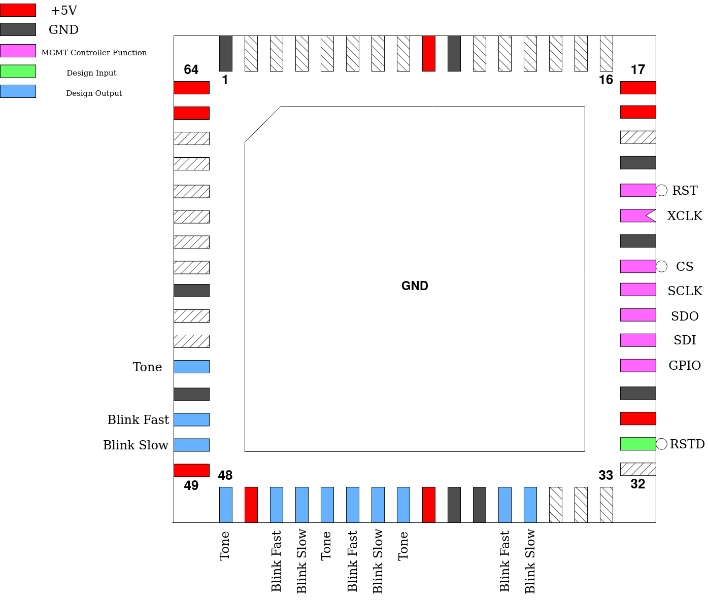

.. _blinker:

LED Blinker
===========

This design blinks LEDs slow or fast and one output oscillates fast enough to be an audible tone. Its the absolute minimum design using the Verilog template all the projects on the die use. This design working during bring-up should be the first indication that the multiplexer is good.

Pinout
------

.. list-table:: Pin description
    :name: pin-description-led-blikner
    :header-rows: 1
    
    * - Pin #
      - Name
      - Type
      - Summary
    * - ``mprj_io[0]``
      - RSTD
      - I
      - Active low design reset
    * - ``mprj_io[5]``, ``mprj_io[8]``, ``mprj_io[11]``, ``mprj_io[14]``
      - Blink Slow
      - O
      - Slow frequency LED blink
    * - ``mprj_io[6]``, ``mprj_io[9]``, ``mprj_io[12]``, ``mprj_io[15]``
      - Blink Fast
      - O
      - High frequency LED blink
    * - ``mprj_io[7]``, ``mprj_io[10]``, ``mprj_io[13]``, ``mprj_io[16]``
      - Tone
      - O
      - Even higher frequency signal, audible
