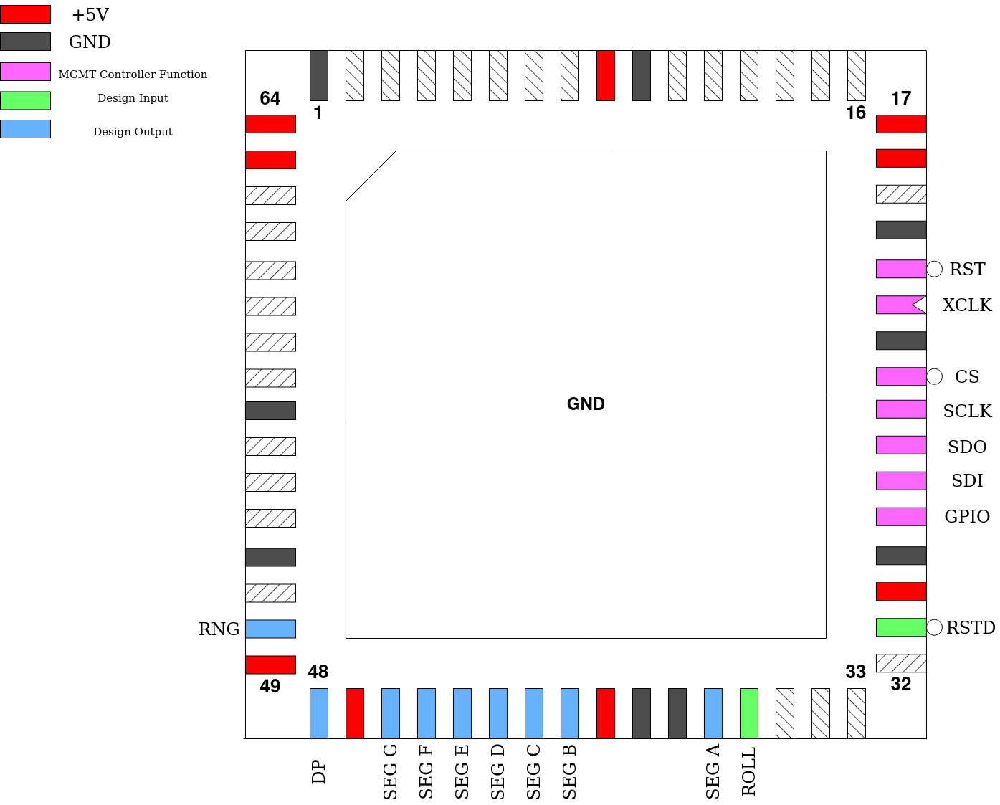

.. _diceroll:

Diceroll
========

This is a resubmission of a Tiny Tapeout 2 project of mine, only on here as a reminder of where I started. The design needs to have a single 7-segment display connected to it and has a single input for a push button: ``ROLL``. When ``ROLL`` is activated, an animation of numbers "rolling" across the display is played before eventually settling on a random number. The decimal point illuminates to indicate that the animation has finished.

The RNG is a simple LFSR that is always shifting, even when the animation isn’t playing. So the sequence depends on the exact time intervals between button presses and should therefor be different each time.

Pinout
------

.. list-table:: Pin description
    :name: diceroll-pin-description
    :header-rows: 1
    
    * - Pin #
      - Name
      - Type
      - Summary
    * - ``mprj_io[0]``
      - RSTD
      - I
      - Active low design reset
    * - ``mprj_io[1]``
      - ROLL
      - I
      - Pulse high to begin dice rolling animation
    * - ``mprj_io[12:6]``
      - SEG A - G
      - O
      - Segment outputs to 7-segment display LEDs
    * - ``mprj_io[13]``
      - DP
      - O
      - Output to 7-segment display Decimal Point LED
    * - ``mprj_io[14]``
      - RNG
      - O
      - Wired to one of the bits in the LFSR
