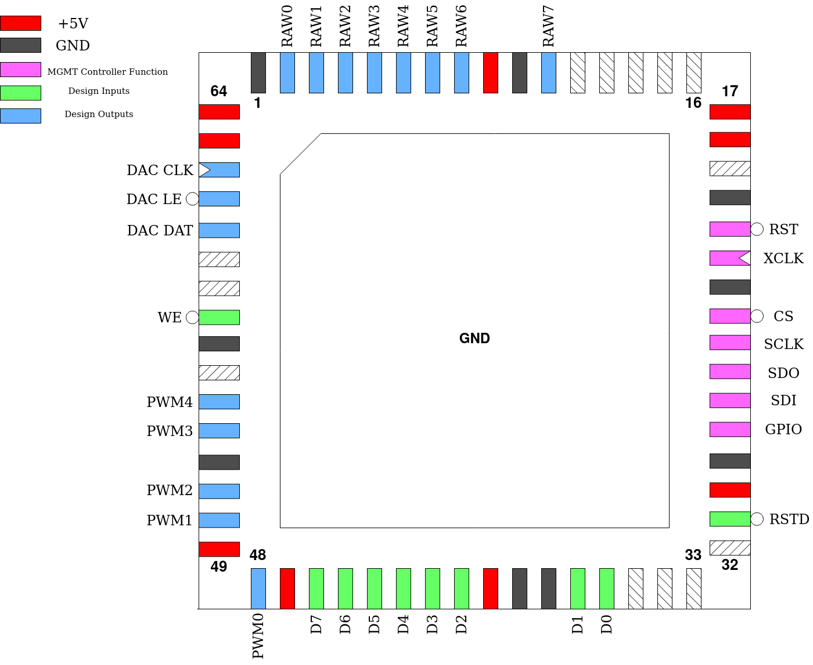
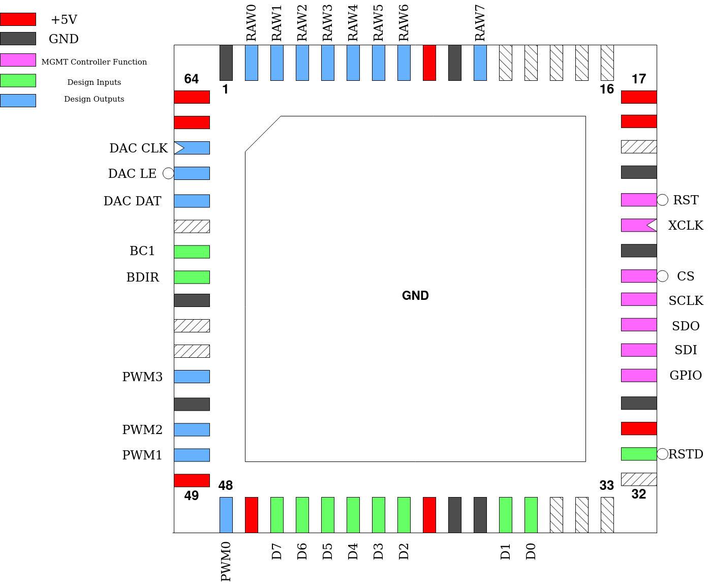

.. _rejs_designs:

Rejunity’s Designs
==================

Two designs on this GFMPW-1 submission were contributed by Rejunity. More information on these can be found at these links:

`SN76489 <https://github.com/rejunity/tt05-psg-sn76489>`__

`AY8913 <https://github.com/rejunity/tt05-psg-ay8913>`__

-------
Pinouts
-------

The pinouts of these projects on this particular chip are:

SN76489
-------

.. list-table:: Pin description
    :name: pin-description-sn76489
    :header-rows: 1
    
    * - Pin #
      - Name
      - Type
      - Summary
    * - ``mprj_io[0]``
      - RSTD
      - I
      - Active low design reset
    * - ``mprj_io[12:5]``
      - D[7:0]
      - I
      - Data Inputs
    * - ``mprj_io[16:13]``
      - PWM[3:0]
      - O
      - Individual PWM audio output for each channel
    * - ``mprj_io[17]``
      - PWM4
      - O
      - PWM audio output for mixed audio from all channels
    * - ``mprj_io[19]``
      - WE
      - I
      - Active low Write Enable
    * - ``mprj_io[22]``
      - DAC DAT
      - O
      - Serial Data for external DAC (DAC7611 or similar)
    * - ``mprj_io[23]``
      - DAC LE
      - O
      - Active low Latch Enable for external DAC
    * - ``mprj_io[24]``
      - DAC CLK
      - O
      - Serial Clock for external DAC
    * - ``mprj_io[32:25]``
      - RAW[7:0]
      - O
      - Raw digital audio sample output with 8-bit resolution

AY8913
------

.. list-table:: Pin description
    :name: pin-description-ay8913
    :header-rows: 1
    
    * - Pin #
      - Name
      - Type
      - Summary
    * - ``mprj_io[0]``
      - RSTD
      - I
      - Active low design reset
    * - ``mprj_io[12:5]``
      - D[7:0]
      - I
      - Data Inputs
    * - ``mprj_io[15:13]``
      - PWM[2:0]
      - O
      - Individual PWM audio output for each channel
    * - ``mprj_io[16]``
      - PWM4
      - O
      - PWM audio output for mixed audio from all channels
    * - ``mprj_io[19]``
      - BDIR
      - I
      - Bus control signal
    * - ``mprj_io[20]``
      - BC1
      - I
      - Bus control signal
    * - ``mprj_io[22]``
      - DAC DAT
      - O
      - Serial Data for external DAC (DAC7611 or similar)
    * - ``mprj_io[23]``
      - DAC LE
      - O
      - Active low Latch Enable for external DAC
    * - ``mprj_io[24]``
      - DAC CLK
      - O
      - Serial Clock for external DAC
    * - ``mprj_io[32:25]``
      - RAW[7:0]
      - O
      - Raw digital audio sample output with 8-bit resolution

---------------
Custom Settings
---------------

Both designs use the first two bits of reg_mprj_settings to set a clock divider for the whole design.

SN76489
-------

.. list-table:: Clock divider options
    :name: clkdiv-opts-sn76489
    :header-rows: 1
    
    * - reg_mprj_settings value
      - Setting
    * - 0
      - Div by 16
    * - 1
      - Div by 1
    * - 2
      - Div by 128

AY8913
------

.. list-table:: Clock divider options
    :name: clkdiv-opts-ay8913
    :header-rows: 1
    
    * - reg_mprj_settings value
      - Setting
    * - 0
      - Div by 8
    * - 1
      - Div by 1
    * - 2
      - Div by 128
