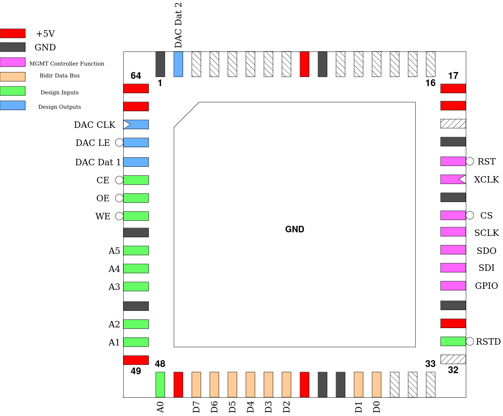

.. _sid:

SID
===

This design is a functional replica of the C64 SID (Sound Interface Device) chip, a programmable sound generator. It actually contains two SIDs intended to output stereo audio. There are only a few functional differences.

The presence of an additional address bit to select between the two SIDs and the use of external DACs (DAC7611 or similar). Also, the POT registers are unimplemented and no external filter capacitors are required. Lastly, all registers marked write-only in the original SID are also readable in this design.

Lastly, the chip requires an input clock 8 times faster than that of the original SID. Consider this clock as going through a by-8 clock divider before being used in the PSG. An input clock of 8MHz should make it match the output of the C64 SID.

For more information see `this page. <https://www.waitingforfriday.com/?p=661>`__

------
Pinout
------

.. list-table:: Pin description
    :name: pin-description-sid
    :header-rows: 1
    
    * - Pin #
      - Name
      - Type
      - Summary
    * - ``mprj_io[0]``
      - RSTD
      - I
      - Active low design reset
    * - ``mprj_io[12:5]``
      - D[7:0]
      - IO
      - Bi-directional data bus
    * - ``mprj_io[18:13]``
      - A[5:0]
      - I
      - Address bus, addressing one of the SID registers
    * - ``mprj_io[19]``
      - WE
      - I
      - Active low Write Enable
    * - ``mprj_io[20]``
      - OE
      - I
      - Active low Output Enable
    * - ``mprj_io[21]``
      - CE
      - I
      - Active low Chip Enable, conditioning WE and OE
    * - ``mprj_io[22]``
      - DAC Dat 1
      - O
      - Serial Data for left-side external DAC
    * - ``mprj_io[23]``
      - DAC LE
      - O
      - Active low Latch Enable for external DACs
    * - ``mprj_io[24]``
      - DAC CLK
      - O
      - Serial Clock for external DACs
    * - ``mprj_io[25]``
      - DAC Dat 2
      - O
      - Serial Data for right-side external DAC
