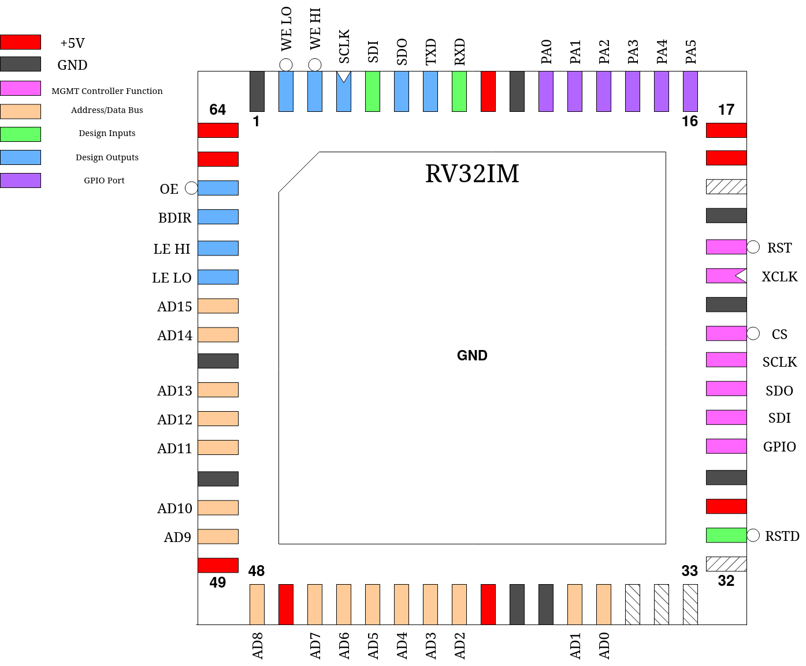

.. _tholin_riscv:

Tholin’s RISC-V
===============

This project is a RV32IM CPU core intended to deliver high performance through high memory throughput despite the limited number of IO pins. Normally, CPU designs on caravel have to either use slow serial memories or put RAM on-die, both of which are suboptimal due to low memory speed and low memory capacity respectively.

An attempt is made here to solve this and provide a relatively high-speed memory interface at the cost of only just over half of the ``mprj_io`` pins and moderately increased board complexity.

Note, however, that this CPU was not made to be pipelined due to time constraints and thus does not offer the theoretically highest possible performance, but should still be superior in memory-bound applications.

------
Pinout
------

.. list-table:: Pin description
    :name: pin-description-riscv
    :header-rows: 1
    
    * - Pin #
      - Name
      - Type
      - Summary
    * - ``mprj_io[0]``
      - RSTD
      - I
      - Active low design reset
    * - ``mprj_io[20:5]``
      - AD[15:0]
      - IO
      - 16-bit bus multiplexing addresses and data
    * - ``mprj_io[21]``
      - LE LO
      - O
      - Latch enable for low (bits 0 - 15) address word
    * - ``mprj_io[22]``
      - LE HI
      - O
      - Latch enable for high (bits 16 - 30) address word
    * - ``mprj_io[23]``
      - BDIR
      - O
      - Indicates direction of bus pins, low = output, high = input
    * - ``mprj_io[24]``
      - OE
      - O
      - Active low memory Output Enable
    * - ``mprj_io[25]``
      - WE LO
      - O
      - Active low memory Write Enable for low byte (bits 0 - 7)
    * - ``mprj_io[26]``
      - WE HI
      - O
      - Active low memory Write Enable for high byte (bits 8 - 15)
    * - ``mprj_io[27]``
      - SCLK
      - O
      - SPI master port Serial Clock
    * - ``mprj_io[28]``
      - SDI
      - I
      - SPI master port Serial Data In
    * - ``mprj_io[29]``
      - SDO
      - O
      - SPI master port Serial Data Out
    * - ``mprj_io[30]``
      - TXD
      - O
      - UART Serial Data Out
    * - ``mprj_io[31]``
      - RXD
      - I
      - UART Serial Data In
    * - ``mprj_io[37:32]``
      - PA[5:0]
      - IO
      - Programmable GPIO port

----------
Memory Bus
----------

The main feature of this design is the 16-bit wide Address/Data bus which transfers address and data information 16 bits at a time. Externally, the chip addresses memory as an array of 16-bit values. Each address emitted is a 16-bit word address with a length of 31 bits. As both halves of the address are multiplexed onto the same pins, transparent latches (ie 74HC573) need to be used to latch the full address. The pins ``LE_LO`` and ``LE_HI`` can be used as enables for these latches to first pass through, then latch the address halves.

This is then followed by the actual data read or write. A low level on ``OE`` indicates a read. However, because RISC-V has instructions for only storing single bytes, it is possible that only one half of a 16-bit word needs to be modified. The outputs ``WE LO`` and ``WE HI`` indicate which halves of the currently addressed word need to be updated:

.. list-table:: Possible Write-Enable states
    :name: riscv-we-states
    :header-rows: 1
    
    * - ``WE HI``
      - ``WE LO``
      - Halves updated
    * - ``1``
      - ``1``
      - Neither (no write)
    * - ``1``
      - ``0``
      - Low half, bits 0 - 7
    * - ``0``
      - ``1``
      - High half, bits 8 - 15
    * - ``0``
      - ``0``
      - Both halves, bits 0 - 15

Most parallel RAM ICs with a 16-bit organization support this addressing scheme with two separate write enable signals, so no additional logic should be required to connect memory to this design.

Example timing diagram of the fetch and execute of a 32-bit store instruction, showing most possible bus states:

.. wavedrom::

    {signal: [
    {name: 'CLK', wave: 'n...........', period: 2},
    {name: 'LE LO', wave: '010....10....10....10...'},
    {name: 'LE HI', wave: '0..10..........10.......'},
    {name: 'OE', wave: '1....0.1.0.1............'},
    {name: 'WE LO', wave: '1................01..01.'},
    {name: 'WE HI', wave: '1................01..01.'},
    {name: 'AD[15:0]', wave: 'z5.6.7.5.7.z.5.6.8.5.8.z', data: 'addr[15:0] addr[30:16] data[15:0] addr[15:0] data[31:16] addr[15:0] addr[30:16] data[15:0] addr[15:0] data[31:16]'},
    {name: 'BDIR', wave: '10...1.0.1...0.........1'}
    ],config: { hscale: 1 }}

Note ``reg_mprj_settings`` == 2 in this example.

-----------
Peripherals
-----------

There are several on-die peripherals included with this design, all of which are accessed via memory mapped registers starting at address ``FFFFFF00h``. These final 256 addresses of memory are used to address these registers, which are all 32-bit wide. Only 32-bit load/store instructions may be used to access them. Accessing any one of these memory locations will not trigger signals on ``OE``, ``WE LO`` or ``WE HI``, though the address may partially be latched by ``LE LO``.

Serial ports
------------

There are two serial ports accessible to the CPU:

The UART, exposed through pins ``RXD`` and ``TXD``, a full-duplex asynchronous serial port that can send and receive 8-N-1 data frames at a custom baudrate. It is possible for the UART to trigger an interrupt upon receipt of a character on ``RXD``.

A SPI master port, exposed through pins ``SDI``, ``SDO`` and ``SCLK`` also with a custom bitclock.

``SDIV`` - SPI Clock Divider

Address: ``FFFFFF00h``

.. wavedrom::

	{ "reg": [
	  {"name": "SDIV[7:0]", "bits": 8},{"type": "1", "bits": 24}],
	 "config": {"hspace": 700}
	}

This register defines the amount by which the processor clock is divided to arrive at the SPI serial clock. The SPI serial clock will be equal to ``CPU clock / (SDIV * 2 + 1)``.

``SDR`` - SPI Data Register

Address: ``FFFFFF04h``

.. wavedrom::

	{ "reg": [
	  {"name": "SDR[7:0]", "bits": 8},{"type": "1", "bits": 24}],
	 "config": {"hspace": 700}
	}

This register is used to transfer bytes in and out of the SPI port. Writing this register immediately begins a SPI full-duplex transfer. The SPI busy flag is set and the written data byte is serially transmitted at the same time as a data byte is received. No further writes to this location should be made while the busy flag is set.

Once the transfer is complete as indicated by the busy flag becoming clear, the received data byte can be obtained by reading from this location.

``UDIV`` - UART Clock Divider

Address: ``FFFFFF08h``

.. wavedrom::

	{ "reg": [
	  {"name": "UDIV[15:0]", "bits": 16},{"type": "1", "bits": 16}],
	 "config": {"hspace": 700}
	}

This register defines the amount by which the processor clock is divided to arrive at the UART bitclock. The UART bitclock will be equal to ``CPU clock / (UDIV + 1)``.

``UDR`` - UART Data Register

Address: ``FFFFFF0Ch``

.. wavedrom::

	{ "reg": [
	  {"name": "UDR[7:0]", "bits": 8},{"type": "1", "bits": 24}],
	 "config": {"hspace": 700}
	}

This register address is used to provide the UART data to transmit as well as read received data. When written to, the UART will immediatly activate, set its busy flag and begin serially transmitting the provided data byte. No further writes to this location should be made while the busy flag is set.

When read, the UDR will contain the latest data byte received by the UART. Accessing this location with a read will also clear the ``UHB`` flag.

``STAT`` - Serial Status Register

Address: ``FFFFFF10h``

.. wavedrom::

	{ "reg": [
	  {"name": "UART BUSY", "bits": 1},{"name": "UHB", "bits": 1},{"name": "SPI BUSY", "bits": 1},{"type": "1", "bits": 29}],
	 "config": {"hspace": 2800}
	}

This read-only register contains status information for both the UART and SPI master ports. Besides their respective busy flags, the STAT also contains ``UHB``, a flag which indicates that the UART has received a data byte which has not yet been read out of the ``UDR``.

GPIO Port
---------

The pins ``PA0`` through ``PA5`` form a 6-bit wide general-purpose IO port with individually programmable direction and data.

``DDRA`` - Data Direction Register A

Address: ``FFFFFF14h``

.. wavedrom::

	{ "reg": [
	  {"name": "DDRA[5:0]", "bits": 6},{"type": "1", "bits": 26}],
	 "config": {"hspace": 700}
	}

This register allows individually changing each port pin between an input and output port. A logic one equals an output port while a logic zero equals an input port. This register resets to a value of 0.

``PORTA`` - Port Data Register A

Address: ``FFFFFF18h``

.. wavedrom::

	{ "reg": [
	  {"name": "PORTA[5:0]", "bits": 6},{"type": "1", "bits": 26}],
	 "config": {"hspace": 700}
	}

This register allows individually setting the state of every port bit configured as an output port. This register resets to a value of 0.

``PINA`` - Port Input A

Address: ``FFFFFF1Ch``

.. wavedrom::

	{ "reg": [
	  {"name": "PINA[5:0]", "bits": 6},{"type": "1", "bits": 26}],
	 "config": {"hspace": 700}
	}

This address returns the states of all port bits configured as inputs. It is read-only.

Timers
------

There are two 32-bit timers, Timer 0 and Timer 1, with customizable prescalers present, one of which is capable of generating interrupts. Their counts may be set and read by the CPU at any time.

Each timer counts up from 0 at the rate defined by ``TDIVx`` until its value reaches ``TTOPx``, at which point it resets back to 0 and continues counting up from there. Timer 1 may optionally generate a interrupt each time it resets in this manner.

``TDIV0`` - Timer Clock Div 0 (prescaler)

Address: ``FFFFFF2Ch``

.. wavedrom::

	{ "reg": [
	  {"name": "TDIV0[31:0]", "bits": 32}],
	 "config": {"hspace": 700}
	}

This register defines the amount by which the processor clock is divided to arrive at the timer count rate for Timer 0. The rate will be equal to ``CPU clock / max(TDIV0, 1)``.

``TDIV1`` - Timer Clock Div 1 (prescaler)

Address: ``FFFFFF30h``

.. wavedrom::

	{ "reg": [
	  {"name": "TDIV1[31:0]", "bits": 32}],
	 "config": {"hspace": 700}
	}

This register defines the amount by which the processor clock is divided to arrive at the timer count rate for Timer 1. The rate will be equal to ``CPU clock / max(TDIV1, 1)``.

``TTOP0`` - Timer Top 0

Address: ``FFFFFF34h``

.. wavedrom::

	{ "reg": [
	  {"name": "TTOP0[31:0]", "bits": 32}],
	 "config": {"hspace": 700}
	}

The maximum value Timer 0 will count up to before reseting to 0.

``TTOP1`` - Timer Top 1

Address: ``FFFFFF38h``

.. wavedrom::

	{ "reg": [
	  {"name": "TTOP1[31:0]", "bits": 32}],
	 "config": {"hspace": 700}
	}

The maximum value Timer 1 will count up to before reseting to 0.

``TMR0`` - Timer 0

Address: ``FFFFFF3Ch``

.. wavedrom::

	{ "reg": [
	  {"name": "TMR0[31:0]", "bits": 32}],
	 "config": {"hspace": 700}
	}

This register holds the actual value of Timer 0. Reading it will get the current timer count. Writing it will set it, with the timer continuing to count up from the new value unless said value is greater than or equal to ``TTOP0``, in which case it will immediately reset to 0 the next time the prescaler expires and the timer is updated.

``TMR1`` - Timer 1

Address: ``FFFFFF40h``

.. wavedrom::

	{ "reg": [
	  {"name": "TMR1[31:0]", "bits": 32}],
	 "config": {"hspace": 700}
	}

This register holds the actual value of Timer 1. Reading it will get the current timer count. Writing it will set it, with the timer continuing to count up from the new value unless said value is greater than or equal to ``TTOP1``, in which case it will immediately reset to 0 the next time the prescaler expires and the timer is updated.

----------
Interrupts
----------

Tholin’s RISC-V supports a basic interrupt model where one of several interrupt sources can generate an Interrupt Request (IRQ) which will cause the CPU to branch to a new location defined by ``IVEC`` upon completion of the current instruction, which is intended to hold an interrupt handler. Unlike a regular JAL instruction, however, the old Program Counter value is moved into one of the memory-mapped registers instead of a general-purpose register, for use in an eventual return from the interrupt handler. The custom ``iret`` instruction needs to be used for this purpose. No other action is taken, and the general-purpose registers must be backed up to memory in software, as needed.

Before any interrupts can be generated, bits in ``IEN`` need to be set to enable individual interrupts and the custom ``sei`` instruction executed to enable interrupts globally. ``cli`` can be used to disable interrupts globally again, independent of the settings in ``IEN``. After reset, ``IEN`` and the global interrupt enable are both clear. This global interrupt enable exists to prevent further interrupts from triggering while another is already being handled, as interrupts cannot stack. It is cleared at the beginning of an interrupt.

As there are several IRQ sources, numbered ``IRQ0`` through ``IRQ2``, but only one interrupt can be handled at one time, each IRQ is actually a latch which is set when an interrupt is triggered. Upon completion of a interrupt handler, further interrupts will be triggered immediately until all IRQ latches are clear.

The clearing of IRQ latches is not automatic and needs to be done in software by writing to a specific memory-mapped register. If this is not done, the interrupt logic will mistakenly believe the interrupt has not yet been served and re-trigger it indefinitely. IRQs can also be cleared outside the interrupt handler code to effectively "cancel" that interrupt. Clearing an interrupt enable in ``IEN`` also immediately clears that IRQ.

Of further note is that the CPU does not distinguish between multiple interrupt handlers and will always branch to ``IVEC``. Instead, it is possible for the CPU to read the ``INUM`` register to know which is the current IRQ being handled and jump to an appropriate subroutine.

The following interrupt sources exist:

External Interrupt
------------------

IRQ #: ``IRQ0``

When the external interrupt is enabled in ``IEN``, a low-to-high transition on pin ``PA5`` triggers this interrupt. ``PA5`` must be set to an input using ``DDRA`` beforehand. The state of the ``PA5`` input can still be read through ``PINA``.

The interrupt must be cleared by writing a zero to address ``FFFFFF1Ch``.

Timer 1 Interrupt
-----------------

IRQ #: ``IRQ1``

When enabled in ``IEN``, Timer 1 will generate this interrupt every time it reaches ``TTOP1`` and resets to 0.

The interrupt must be cleared by writing a zero to address ``FFFFFF44h``.

UART Interrupt
--------------

IRQ #: ``IRQ2``

When enabled in ``IEN``, the UART will generate this interrupt whenever a complete character has been received and is now available to be read out of the ``UDR``.

The interrupt must be cleared by reading ``UDR``.

Registers
---------

There are several memory-mapped registers involved in controlling the interrupt logic. These are:

``IVEC`` - Interrupt Vector Address

Address: ``FFFFFF20h``

.. wavedrom::

	{ "reg": [
	  {"type": "1", "bits": 2},{"name": "IVEC[31:2]", "bits": 30}],
	 "config": {"hspace": 700}
	}

This register holds the address of the first instruction of the interrupt handler. As RISC-V requires all instructions be alligned to 32-bit words, the least-significant two bits of this register are always 0.

``INUM`` - Current Interrupt Number

Address: ``FFFFFF24h``

.. wavedrom::

	{ "reg": [
	  {"name": "INUM[1:0]", "bits": 2},{"type": "1", "bits": 30}],
	 "config": {"hspace": 1200}
	}

This read-only register holds the number of the current IRQ being handled plus one. This can be used by interrupt handler code to learn which exact interrupt it is handling, and jump to a appropriate subroutine. If the CPU is not currently handling an interrupt, this register reads zero.

``IEN`` - Interrupt Enables

Address: ``FFFFFF28h``

.. wavedrom::

	{ "reg": [
	  {"name": "IRQ0EN", "bits": 1},{"name": "IRQ1EN", "bits": 1},{"name": "IRQ2EN", "bits": 1},{"type": "1", "bits": 29}],
	 "config": {"hspace": 1900}
	}

This register contains three bits that individually enable one of the three interrupts. It is cleared to zero on reset.

``PREVPC`` - Previous Program Counter Backup

Address: ``FFFFFF48h``

.. wavedrom::

	{ "reg": [
	  {"type": "1", "bits": 2},{"name": "PREVPC[31:2]", "bits": 30}],
	 "config": {"hspace": 700}
	}

This register is used as a location to back up the previous Program Counter value to, at the beginning of an interrupt. It is read-only.

The ``iret`` instruction
------------------------

Opcode: ``26D00073h``

This is the instruction used to return from interrupts. It restores the Program Counter value from the backup made at the beginning of the interrupt and then `inverts` the global interrupt enable. As the global interrupt enable is cleared at the beginning of an interrupt, this has the effect of enabling it again, allowing further interrupts to take place.

The ``sei`` instruction
-----------------------

Opcode: ``00700073h``

This instruction sets the global interrupt enable.

The ``cli`` instruction
-----------------------

Opcode: ``00800073h``

This instruction clears the global interrupt enable.

---------------
Custom Settings
---------------

This design makes use of the ``reg_mprj_settings`` wishbone register. Specifically, it can be used to change the behavior of the ``WE HI`` and ``WE LO`` pins to change the width and timing of them, which may be required depending on the exact memory IC used with the design. There are three possible settings (the default is zero):

``0``: ``WE LO``/``WE HI`` is active for a full clock cycle.

``1``: ``WE LO``/``WE HI`` is only active when the clock is low.

``2``: ``WE LO``/``WE HI`` is only active when the clock is high.
